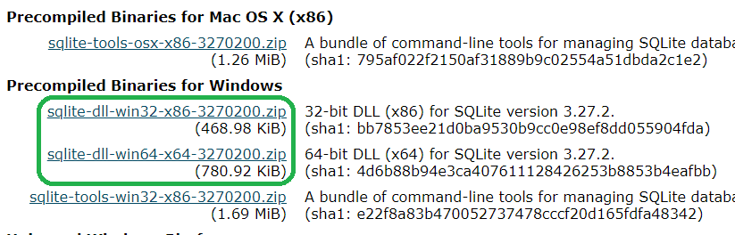
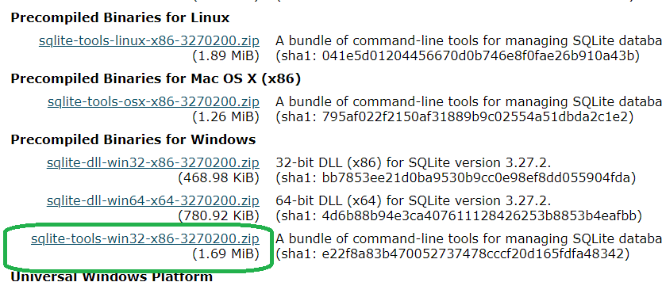
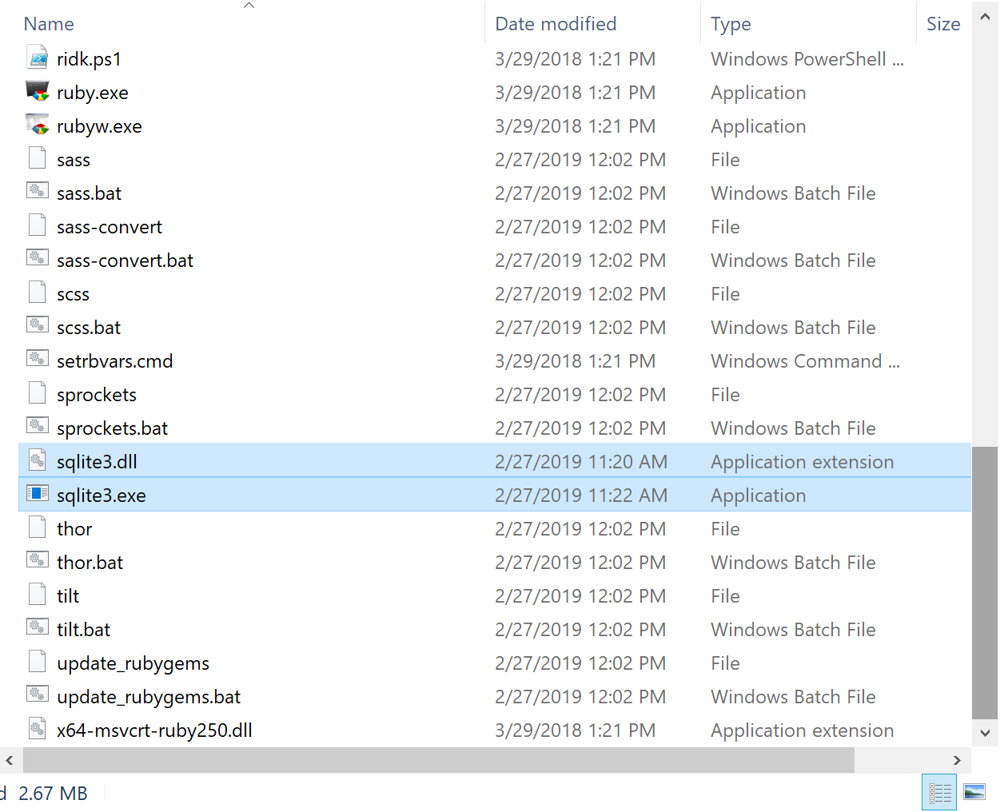

# **Tweet App Ruby on Rails**

> Halo! ini adalah project Tweet App menggunakan Ruby on Rails. Yuk kita mulai aja dengan langkah-langkah dibawah ini!

## **A. Setup Rails Apps**

### 1. Install Ruby on Rails

```console
rails new tweet-app
```
### 2. Run tweet-app

```console
rails s
```
## **B. Setup Controller Home**

### 1. Membuat Controller Home

```console
rails g controller home top
```

```ruby
class HomeController < ApplicationController
  def top
  end
end
```

> artinya: membuat controller `home` yang di dalamnya ada `action` (method) `top`

### 2. Setting Routes

Tambahkan action `top`, jadi ketika mengakses url `home/top` maka akan di panggil controller `home` dengan action (method) `top`

```ruby
Rails.application.routes.draw do
  get '/top' => 'home#top'
end
```

### 3. Tambahkan Content Top

Tambahkan kode HTML ini di dalam file `views/home/top.html.erb`
```HTML
<header>
  <div class="header-logo">
    <a href="/">TweetApp</a>
  </div>
  <ul class="header-menus">
    <li><a href="/about">About</a></li>
  </ul>
</header>
<div class="main top-main">
  <div class="top-message">
    <h2>Tweet to the world.<br>Connect to the world.</h2>
    <p>Share your favorite moments!</p>
  </div>
</div>
```

### 4. Tambahkan Method About

Tambahkan action (method) `about` di controllers `home_controller.rb`
```ruby
class HomeController < ApplicationController
  def top
  end

  def about
  end
end
```

### 5. Tambahkan Content About

Tambahkan HTML pada `views/home/about.html.erb`
```HTML
<header>
  <div class="header-logo">
    <a href="/">TweetApp</a>
  </div>
  <ul class="header-menus">
    <li><a href="/about">About</a></li>
  </ul>
</header>
<div class="about-main">
  <h2>About TweetApp</h2>
  <p>
    TweetApp is a social networking service.
    Users can post and interact with short messages called "tweets".
  </p>
</div>
```

### 6. Tambahkan Routes About

Tambahkan `get` `/about` yang mengakses controller `home` dengan action `about`
```ruby
Rails.application.routes.draw do
  get '/top' => 'home#top'
  get '/about' => 'home#about'
end
```

## **C. Styling I**

### 1. Tambahkan Code CSS

Tambahkan `code` css ini di `home.scss`
```scss
* {
    box-sizing: border-box;
  }
  
  html {
    font: 100%/1.5 'Avenir Next', 'Hiragino Sans', sans-serif;
    line-height: 1.7;
    letter-spacing: 1px;
  }
  
  ul, li {
    list-style-type: none;
    padding: 0;
    margin: 0;
  }
  
  a {
    text-decoration: none;
    color: #2d3133;
    font-size: 14px;
  }
  
  h1, h2, h3, h4, h5, h6, p {
    margin: 0;
  }
  
  input {
    background-color: transparent;
    outline-width: 0;
  }
  
  form input[type="submit"] {
    border: none;
    cursor: pointer;
  }
  
  /* Common Layout ================================ */
  body {
    color: #2d3133;
    background-color: #3ecdc6;
    margin: 0;
    min-height: 1vh;
  }
  
  .main {
    position: absolute;
    top: 64px;
    width: 100%;
    height: auto;
    min-height: 100%;
    background-color: #f5f8fa;
  }
  
  .container {
    max-width: 600px;
    margin: 60px auto;
    padding-left: 15px;
    padding-right: 15px;
    clear: both;
  }
  
  /* Header ================================ */
  header {
    height: 64px;
    position: absolute;
    z-index: 1;
    width: 100%;
  }
  
  .header-logo {
    float: left;
    padding-left: 20px;
    color: white;
    font-size: 22px;
    line-height: 64px;
  }
  
  .header-logo a{
    color: white;
    font-size: 22px;
  }
  
  .header-menus {
    float: right;
    padding-right: 20px;
  }
  
  .header-menus li {
    float: left;
    line-height: 64px;
    font-size: 13px;
    color: white;
    padding-left: 15px;
  }
  
  .header-menus a {
    float: left;
    font-size: 13px;
    color: white;
  }
  
  .header-menus .fa {
    padding-right: 5px;
  }
  
  .header-menus input[type="submit"] {
    padding: 0 20px;
    float: left;
    line-height: 64px;
    color: white;
    margin: 0;
    font-size: 13px;
  }
  
  /* Top ================================ */
  .top-main {
    padding: 200px 0 100px;
    text-align: center;
    position: absolute;
    top: 0;
    width: 100%;
    height: auto;
    min-height: 100%;
    color: white;
    background-color: #3ecdc6;
    background-repeat: no-repeat;
    background-position: center 50%;
    background-size: cover;
    background-image: url("/top.jpeg");
  }
  
  .top-message {
    position: relative;
  }
  
  .top-main h2 {
    font-size: 70px;
    font-weight: 500;
    line-height: 1.3;
    -webkit-font-smoothing: antialiased;
    margin-bottom: 20px;
  }
  
  .top-main p {
    font-size: 24px;
  }
  
  /* About ================================ */
  .about-main {
    padding: 180px 8% 0;
    color: white;
  }
  
  .about-main h2 {
    font-size: 64px;
    font-weight: 500;
    line-height: 1.4;
  }
  
  .about-main p {
    font-weight: 200;
    font-size: 20px;
  }
  
  .about-img {
    width: 84%;
  }
  
  /* Form ================================ */
  .form {
    max-width: 600px;
    margin: 0 auto;
    background-color: white;
    box-shadow: 0 2px 6px #c1ced7;
  }
  
  .form-heading {
    font-weight: 300;
    margin: 60px 0 20px;
    font-size: 48px;
    color: #bcc8d4;
  }
  
  .form-body {
    padding: 30px;
  }
  
  .form-error {
    color: #ff4d75;
  }
  
  .form input {
    width: 100%;
    border: 1px solid #d8dadf;
    padding: 10px;
    color: #57575f;
    font-size: 16px;
    letter-spacing: 2px;
    border-radius: 2px;
  }
  
  .form textarea {
    width: 100%;
    min-height: 110px;
    font-size: 16px;
    letter-spacing: 2px;
  }
  
  .form input[type="submit"] {
    background-color: #3ecdc6;
    color: white;
    cursor: pointer;
    font-weight: 300;
    width: 120px;
    border-radius: 2px;
    margin-top: 8px;
    margin-bottom: 0;
    float: right;
  }
  
  .form-body:after {
    content: '';
    display: table;
    clear: both;
  }
  
  /* Flash ================================ */
  .flash {
    padding: 10px 0;
    color: white;
    background: rgb(251, 170, 88);
    text-align: center;
    position: absolute;
    top: 64px;
    z-index: 10;
    width: 100%;
    border-radius: 0 0 2px 2px;
    font-size: 14px;
  }
```

Tambahkan `top.jpeg` background di top-main `home.scss`

```scss
  /* top main */
  background-image: url("/top.jpeg");
```

### 2. Tambahkan Gambar Tweets

Tambahkan `tweets.png` di content `about.html.erb`.
```HTML
<header>
  <div class="header-logo">
    <a href="/">TweetApp</a>
  </div>
  <ul class="header-menus">
    <li><a href="/about">About</a></li>
  </ul>
</header>
<div class="about-main">
  <h2>About TweetApp</h2>
  <p>
    TweetApp is a social networking service.
    Users can post and interact with short messages called "tweets".
  </p>
  
</div>
```

## **D. Displaying Posts**

### 1. Buat Controller Post

Tambahkan controller `Post` dengan action `index`

```console
rails g controller Post index
```

```ruby
class PostController < ApplicationController
  def index
  end
end
```

### 2. Tambahkan di Routes

Tambahkan `get` di routes untuk `post/index`

```ruby
Rails.application.routes.draw do
  get '/top' => 'home#top'
  get '/about' => 'home#about'
  get '/post/index' => 'post#index'
end
```

### 3. Tambahkan Post di Header

Tambahkan `Posts` di setiap `header`
```HTML
<header>
  <div class="header-logo">
    <a href="/">TweetApp</a>
  </div>
  <ul class="header-menus">
    <li><a href="/about">About</a></li>
    <li><a href="/post/index">Posts</a></li>
  </ul>
</header>
```

### 4. Tambahkan Content Post

Tambahkan `HTML` ini di `views/post/index.html.erb`

```HTML
<header>
  <div class="header-logo">
    <a href="/">TweetApp</a>
  </div>
  <ul class="header-menus">
    <li>
      <a href="/about">About</a>
    </li>
    <li>
      <a href="/post/index">Posts</a>
    </li>
  </ul>
</header>

<div class="main posts-index">
  <div class="container">
    <div class="posts-index-item">
      Learning Rails with Progate!
    </div>
    <div class="posts-index-item">
      Trying to display the posts!
    </div>
  </div>
</div>
```

### 5. Tambahkan Code CSS

Tambahkan code `css` ini di `post.scss`
```scss
.posts-index-item {
    padding: 20px 30px;
    background-color: white;
    overflow: hidden;
    box-shadow: 0 2px 6px #c1ced7;
  }
  
  .post-left img {
    width: 50px;
    height: 50px;
    border-radius: 40%;
    box-shadow: 0 2px 6px #c1ced7;
    object-fit: cover;
  }
  
  .post-user-name a {
    font-weight: 600;
  }
  
  .post-user-name a:hover {
    color: #3ecdc6;
  }
  
  .post-left {
    float: left;
    width: 10%;
  }
  
  .post-right {
    float: left;
    width: 90%;
    padding-left: 25px;
    text-align: left;
  }
  
  /* posts/show ================================ */
  .posts-show form {
    display: inline;
  }
  
  .posts-show-item {
    padding: 30px;
    background-color: white;
    box-shadow: 0 2px 6px #c1ced7;
    overflow: hidden;
  }
  
  .posts-show-item img {
    width: 60px;
    height: 60px;
    border-radius: 40%;
    box-shadow: 0 2px 6px #c1ced7;
    vertical-align: middle;
    object-fit: cover;
  }
  
  .posts-show-item .post-user-name a {
    vertical-align: middle;
    font-size: 24px;
    margin-left: 15px;
  }
  
  .posts-show-item p {
    font-size: 24px;
    margin: 20px 0;
  }
  
  .post-time {
    color: #8899a6;
    margin-bottom: 10px;
  }
  
  .post-menus {
    float: right;
  }
  
  .post-menus a, .post-menus input {
    color: #8899a6;
    text-decoration: underline;
    font-size: 14px;
  }
  
  /* posts/new ================================ */
  .posts-new textarea {
    font-size: 20px;
    padding: 10px;
    min-height: 140px;
    border: 1px solid rgb(216, 218, 223);
    resize: none;
  }
  
  .posts-new textarea::-webkit-input-placeholder {
    font-size: 24px;
    opacity: 0.5;
  }
```

### 6. Tambahkan Variables di Views

Tambahkan `post1` dan `post2` di `index.html.erb`

```HTML
<header>
  <div class="header-logo">
    <a href="/">TweetApp</a>
  </div>
  <ul class="header-menus">
    <li>
      <a href="/about">About</a>
    </li>
    <li>
      <a href="/post/index">Posts</a>
    </li>
  </ul>
</header>

<% post1 = "Learning Rails with Progate!" %>
<% post2 = "Trying to display the posts!" %>

<div class="main posts-index">
  <div class="container">
    <div class="posts-index-item">
      <%= post1 %>
    </div>
    <div class="posts-index-item">
      <%= post2 %>
    </div>
  </div>
</div>
```

### 7. Menggunakan `each` Method di Views

```HTML
<!-- Header -->
<% posts = [
      "Learning Rails with Progate!",
      "Trying to display the posts!"
    ]
%>

<div class="main posts-index">
  <div class="container">
    <% posts.each do |post| %>
    <div class="posts-index-item">
      <%= post %>
    </div>
    <% end %>
  </div>
</div>
```

### 8. Defining Variables in Actions

Memindahkan menjadi ke action `index` di controller Post
```ruby
class PostController < ApplicationController
  def index
    @posts = [
        "Learning Rails with Progate!",
        "Trying to display the posts!"
    ]
  end
end
```

```HTML
<!-- Header -->
<div class="main posts-index">
  <div class="container">
    <% @posts.each do |post| %>
    <div class="posts-index-item">
      <%= post %>
    </div>
    <% end %>
  </div>
</div>
```

## **E. Menggunakan Database**

### 1. Membuat Migration file

```console
rails g model Post content:text
```

```ruby
class Post < ApplicationRecord
end
```

> `Post`: mesti singular, `content`: adalah nama column, `text`: data type

### 2. Membuat Table

Dengan cara menggunakan `rails db:migrate`

```console
rails db:migrate
```

### 3. Rails console

```console
rails console
Loading development environment (Rails 5.0.3)
[1] pry(main)> 1 + 1
=> 2
[2] pry(main)>
```

### 4. Tambahkan Data ke Table

```console
rails console
.
.
> post1 = Post.new(content: "Learning Rails with Progate!")
> post1.save
```

### 5. Mendapatkan Data dari Table

```console
rails console
.
.
> post = Post.first
> post.content
=> "Learning Rails..."
```

### 6. Mendapatkan Data All dari Table

```console
rails console
.
.
> post = Post.all
# maka isinya akan array
```

```console
rails console
.
.
> post = Post.all[0].content
=> "Learning Rails..."
```

### 7. Menampilkan Posts

```ruby
class PostController < ApplicationController
  def index
    @posts = Post.all
  end
end
```

```HTML
<!-- Header -->
<div class="main posts-index">
  <div class="container">
    <% @posts.each do |post| %>
    <div class="posts-index-item">
      <%= post.content %>
    </div>
    <% end %>
  </div>
</div>
```

## **F. Refactoring Layout**

### 1. Memindahkan `header` ke `application.html.erb`

Hapus semua header di `views` kemudian, buat hanya satu di `applications.html.erb`

```HTML
<header>
  <div class="header-logo">
    <a href="/">TweetApp</a>
  </div>
  <ul class="header-menus">
    <li>
      <a href="/about">About</a>
    </li>
    <li>
      <a href="/post/index">Posts</a>
    </li>
  </ul>
</header>
```

### 2. Ganti anchor link
```HTML
<header>
  <div class="header-logo">
    <%= link_to("TweetApp","/") %>
  </div>
  <ul class="header-menus">
    <li>
    <%= link_to("About","/about") %>
    </li>
    <li>
    <%= link_to("Posts","/post/index") %>
    </li>
  </ul>
</header>
```
## **G. Creating the Post Details Page**

### 1. Auto Generated Column
`id`, `created_at`, `updated_at` itu auto generated.

### 2. The find_by Method'

Kamu dapat menemukan sebuah postingan yang spesifik menggunakan `find_by` method.
```console
rails console
.
.
> post = Post.find_by(id: 3)
> post.content
=> "Isi konten"
```

### 3. The Post Details Page

```ruby
Rails.application.routes.draw do
  get '/post/:id' => 'post#show'
end
```

```ruby
class PostController < ApplicationController
  def show
  end
end
```

Buat `show.html.erb` di `views/post/` dengan code dibawah ini:

```HTML
<div class="main posts-show">
  <div class="container">
    <div class="posts-show-item">
      <p>This page shows the details of a post</p>
    </div>
  </div>
</div>
```

### 4. Mendapatkan ID dari URL

Tambahkan `params[:id]` di `post_controller.rb`
```ruby
# post_controller.rb
def show
  @id = params[:id]
end
```

Tambahkan `<% @id %>` di `show.html.erb`
```Ruby
# show.html.erb
<% @id %>
```

### 5. Menampilkan Post di Detail Page

Tambahkan `content` show di `post_controller.rb`
```ruby
class PostController < ApplicationController
  def index
    @post = Post.all
  end
  def show
    @post = Post.find_by(id: params[:id])
  end
end
```

Tambahkan `content` di `show.html.erb`
```HTML
<div class="main posts-show">
  <div class="container">
    <div class="posts-show-item">
      <p>
        <%= @post.content %>
      </p>
      <div class="post-time">
        <%= @post.created_at %>
      </div>
    </div>
  </div>
</div>
```

### 6. Menambahkan Link ke Detail Post

Menggunakan `link_to` di `show.html.erb`
```Ruby
<%= link_to(post.content, "/post/#{post.id}) %>
```

## **H. Membuat Postingan Baru**

### 1. Membuat Action `new` di routes

Tambahkan code dibawah ini di `routes`
```ruby
get 'post/new' => 'post#new'
```

Tambahkan `action` dibawah ini di `post_controller.rb`
```ruby
class PostController < ApplicationController
  .
  .
  def new
  end
end
```

Tambahkan `menu` di `application.html.erb`
```HTML
<li>
  <%= link_to("New Post","/post/new")%>
</li>
```

Buat file baru `new.html.erb` di `views/post/`
```HTML
<div class="main posts-new">
  <div class="container">
    <h1 class="form-heading">Create a new post</h1>
    <div class="form">
      <div class="form-body">
        <textarea></textarea>
        <input type="submit" value="Post">
      </div>
    </div>
  </div>
</div>
```

### 2. Sending Input Data

Tambahkan code dibawah ini ke `routes`
```ruby
post 'post/create' => 'post#create'
```

Tambahkan `form_tag` di `new.html.erb`
```HTML
<div class="main posts-new">
  <div class="container">
    <h1 class="form-heading">Create a new post</h1>
    <div class="form">
      <%= form_tag("/post/create") do %>
      <div class="form-body">
        <textarea></textarea>
        <input type="submit" value="Post">
      </div>
      <% end %>
    </div>
  </div>
</div>
```

### 3. The Redirect Method

Mengembalikan atau mengarahkan halaman ke halaman yang ditentukan:
```ruby
class PostController < ApplicationController
  .
  .
  def create
    redirect_to("/post/index")
  end
end
```

### 4. Menyimpan Postingan

Tambahkan `name` di `textarea`
```HTML
<textarea name="content"></textarea>
```

Dapatkan di action `create`
```ruby
class PostController < ApplicationController
  .
  .
  def create
    @post = Post.new(content: params[:content])
    @post.save
    redirect_to("/post/index")
  end
end
```

### 5. Sorting Postingan

Arahkan atau sortir menjadi `descending`
```ruby
class PostController < ApplicationController
  def index
    @post = Post.all.order(created_at: :desc)
  end
end
```

## **I. Editing / Deleting Post**

### 1. Editing menggunakan Console

Cari data untuk uji coba menggunakan `console` dan `save`
```console
rails console
.
.
> post = Post.find_by(id: 1)
> post.content = "Selamat pagi!"
> post.save
```

### 2. Deleting menggunakan Console

Cari data untuk uji coba menggunakan `console` dan `destroy`
```console
rails console
.
.
> post = Post.find_by(id: 2)
> post.destroy
```

## **J. Persiapan Editing**

### 1. Editing Post Page

Tambahkan code dibawah ini di `routes`
```ruby
post 'post/:id/edit' => 'post#edit'
```

Tambahkan file `edit.html.erb` di `views/post`
```HTML
<div class="main posts-new">
  <div class="container">
    <h1 class="form-heading">Edit a post</h1>
  </div>
```

Tambahkan file `show.html.erb` di `views/post`
```HTML
<div class="post-menus">
  <%= link_to("Edit", "/posts/#{@post.id}/edit") %>
</div>
```

Tambahkan kode ini di `post_controller.rb`
```ruby
def edit
end
```

### 2. Menambahkan Form dan Update

Tambahkan code dibawah ini di `post_controller.rb`
```ruby
def edit
  @post = Post.find_by(id: params[:id])
end
def update
  @post = Post.find_by(id: params[:id])
  @post.content = params[:content]
  @post.save
  redirect_to("/post/index")
end
```

Ubah file `edit.html.erb` di `views/post` menjadi
```HTML
<div class="main posts-new">
  <div class="container">
    <h1 class="form-heading">Edit a post</h1>
    <div class="form">
    <%= form_tag("/post/#{@post.id}/update") do %>
      <div class="form-body">
        <!-- Display @post's content in textarea -->
        <textarea name="content"><% @post.content %></textarea>
        <input type="submit" value="Save">
      </div>
    <% end %>
    </div>
  </div>
```

Tambahkan code dibawah ini di `routes`
```ruby
post 'post/:id/update' => 'post#update'
```

### 3. Deleting Post

Tambahkan code dibawah ini di `post_controller.rb`
```ruby
def destroy
  @post = Post.find_by(id: params[:id])
  @post.destroy
  redirect_to("/post/index")
end
```

Tambahkan code dibawah ini di `routes`
```ruby
post 'post/:id/destroy' => 'post#destroy'
```

Tambahkan code dibawah ini ke file `show.html.erb` di `views/post`
```HTML
<div class="post-menus">
  <%= link_to("Edit", "/posts/#{@post.id}/edit") %>
  <%= link_to("Delete", "/posts/#{@post.id}/delete", {method: "post"}) %>
</div>
```

## **K. Validating Posts**

### 1. Preventing Empty Posts

Tambahkan `validates` di model Post `post.rb`
```ruby
validates :content, {presence: true}
```

### 2. Limiting the Length Posts

Tambahkan `length` di model Post `post.rb`
```ruby
validates :content, {presence: true,length: {maximum: 140}}
```

## **L. Validation Messages**

### 1. Validation and the "save" method

Uji coba `false` dan `true` di rails console
```console
rails console
.
.
> post = Post.new
> post.save
> false
> post.content = "Nah ayeuna mah aya!"
> post.save
=> "Nah ayeuna mah aya!"
```

### 2. Redirect to the Form

Tambahkan code dibawah ini di `post_controller.rb`
```ruby
def update
  if @post.save
    rediret_to("/posts/index")
  else
    rediret_to("/posts/#{@post.id}/edit")
  end
end
```

### 3. Redisplaying the Content of Failed Post

Tambahkan code dibawah ini di else bagian `update` di `post_controller.rb`
```ruby
def update
  if @post.save
    rediret_to("/posts/index")
  else
    render("/posts/edit")
  end
end
```

### 4. Displaying Error Messages

Uji coba di rails console
```console
rails console
.
.
> post = Post.new(content:"")
> post.errors.full_messages
> post.save
> post.errors.full_messages
=> "content can't blank"
```

### 5. Displaying Flash Messages

Tambahkan code dibawah ini di `post_controller.rb`
```ruby
def update
  if @post.save
    flash[:notice] = "Selamat, data berhasil diubah"
    rediret_to("/post/index")
  else
    render("post/edit")
  end
end
```

Tambahkan code dibawah ini di `application.html.erb`
```ruby
<% if flash[:notice]  %>
  <div class="flash">
    <%= flash[:notice] %>
  </div>
<% end %>
```

## **L. Validation in Other Page**

### 1. Validation on the New Post Page

Tambahkan code dibawah ini di `post_controller.rb`
```ruby
def create
  if @post.save
    flash[:notice] = "Post successfully created"
    rediret_to("/post/index")
  else
    render("post/new")
  end
end
def destroy
@post = Post.find_by(id: params[:id])
  @post.destroy
  flash[:notice] = "Post successfully deleted"
  redirect_to("/posts/index")
end
```

Tambahkan code dibawah ini dan membuat action `new` di `post_controller.rb` supaya data tidak hilang
```ruby
def new
  @post = Post.new
end
```

```ruby
<% @post.errors.full_messages.each do |message| %>
  <div class="form-error">
    <%= message %>
  </div>
<% end %>
```

## **M. The User Model**

### 1. Creating the Table and the Model

```console
rails g model User name:string email:string
rails db:migrate
```
### 2. Creating a User

```console
rails console
.
.
> user = User.new(name: "Lerian", email: "lerian@codale.com)
> user.save
```

### 3. Adding Validations

Tambahkan di models `user.rb`
```ruby
class User < ApplicationRecord
  validates :name, {presence: true}
  validates :email, {presence: true, uniqueness: true}
end
```

Buat akun menggunakan `console`
```console
rails console
.
.
> user1 = User.new(name:"Sopyan",email:"sopyansauri@gmail.com")
> user1.save
> user2 = User.new(name:"Adhie",email:"adhie@gmail.com")
> user2.save
```

## **N. Displaying the Users**

### 1. Creating the Users Page

Buat controller `users` dengan action `index`
```console
rails g controller users index
```

Jika masih error, coba ketik `rails db:migrate`

Tambahkan `@users` di `user_controller.rb`
```ruby
def index
  @users = User.all
end
```

Tambahkan code dibawah ini di `index.html.erb` dalam folder `users` view
```HTML
<div class="main users-index">
  <div class="container">
    <h1 class="users-heading">All Users</h1>
    <!-- Add an each method inside <% %> -->
    <% @users.each do |user| %>
      <div class="users-index-item">
        <div class="user-right">
          <!-- Display the user's name -->
          <%= user.name %>
        </div>
      </div>
    <!-- Add an end statement -->
    <% end %>
  </div>
</div>
```

Tambahkan link untuk `users` di `application.html.erb`
```HTML
<li><%= link_to("Users","/users/index")%></li>
```

Tambahkan css untuk `users.scss`
```css
/* users/index ================================ */
.users-heading {
  font-weight: 300;
  margin: 60px 0 20px;
  font-size: 48px;
  color: #bcc8d4;
}

.users-index-item {
  padding: 20px 30px;
  background-color: white;
  overflow: hidden;
  box-shadow: 0 2px 6px #c1ced7;
  display: table;
  width: 100%;
}

.user-left img {
  width: 50px;
  height: 50px;
  border-radius: 40%;
  box-shadow: 0 2px 6px #c1ced7;
  object-fit: cover;
}

.user-name a {
  font-weight: 600;
}

.user-name a:hover {
  color: #3ecdc6;
}

.user-left {
  float: left;
  width: 10%;
}

.user-right {
  width: 90%;
  padding-left: 25px;
  text-align: left;
  display: table-cell;
  vertical-align: middle;
}

/* users/show ================================ */
.user-show {
  text-align: center;
}

.user {
  margin-bottom: 20px;
}

.user img {
  width: 80px;
  height: 80px;
  border-radius: 40%;
  box-shadow: 0 2px 6px #c1ced7;
  margin: 20px 0 10px;
  object-fit: cover;
}

.user h2 {
  font-size: 20px;
  font-weight: 600;
  line-height: 1.2;
}

.user p {
  font-size: 13px;
  margin-bottom: 15px;
}

.user a {
  color: #8899a6;
  text-decoration: underline;
  font-weight: 200;
}

.user span {
  color: #afb6bf;
  font-weight: 200;
  padding: 0 6px 0 8px;
}

.user-tabs {
  margin-top: 40px;
  background-color: white;
  overflow: hidden;
  box-shadow: 0 2px 6px #c1ced7;
}

.user-tabs li {
  float: left;
}

.user-tabs li.active {
  border-bottom: 2px solid #3ecdc6;
}

.user-tabs li.active a {
  color: #57575f;
}

.user-tabs a {
  display: inline-block;
  padding: 16px 30px;
  color: #afb6bf;
}

/* users/new, users/edit ================================ */
.users-form input {
  margin-bottom: 15px;
}
```

### 2. Creating the Users Details Page

Tambahkan `show` di `routes.rb`
```ruby
get "users/:id" => "users#show"
```

Tambahkan code di `users_controller.rb`
```ruby
def show
  @user = User.find_by(id: params[:id])
end
```

Buat file baru `show.html.erb` di `users` view
```HTML
<div class="main user-show">
  <div class="container">
    <div class="user">
      <!-- Display the @user's name -->
      <h2><%= @user.name %></h2>
      <!-- Display the @user's email -->
      <p><%= @user.email %></p>
    </div>
  </div>
</div>
```

Ubah code dibawah ini di `index.html.erb` dalam folder `users` view
```HTML
<div class="main users-index">
  <div class="container">
    <h1 class="users-heading">All Users</h1>
    <!-- Add an each method inside <% %> -->
    <% @users.each do |user| %>
      <div class="users-index-item">
        <div class="user-right">
          <!-- Display the user's name -->
          <%= link_to(user.name, "/users/#{user.id}") %>
        </div>
      </div>
    <!-- Add an end statement -->
    <% end %>
  </div>
</div>
```

## **O. Creating Users**

### 1. Adding a Form

Tambahkan code dibawah ini di `routes.rb`
```ruby
get "signup" => "/users/new"
```

Tambahkan code dibawah ini di `users_controller.rb`
```ruby
def new
end
```

Tambahkan file baru `new.html.erb` dibawah ini di views `users`
```HTML
<div class="main users-new">
  <div class="container">
    <div class="form-heading">Sign up</div>
    <div class="form users-form">
      <div class="form-body">
        <p>Name</p>
        <input>
        <p>Email</p>
        <input>
        <input type="submit" value="Sign up">
      </div>
    </div>
  </div>
</div>
```

Tambahkan link untuk `signup` di `application.html.erb`
```HTML
<li><%= link_to("Sign Up","/signup") %></li>
```

### 2. Saving the Users

Tambahkan code dibawah ini di `users_controller.rb`
```ruby
def create
  @user = User.new(name: params[:name], email: params[:email])
  @user.save
  redirect_to("/users/#{@user.id}")
end
```

Ubah code di `new.html.erb` dibawah ini di views `users`
```HTML
<div class="main users-new">
  <div class="container">
    <div class="form-heading">Sign up</div>
    <div class="form users-form">
      <div class="form-body">
        <%= form_tag("/users/create) do %>
        <p>Name</p>
        <input name="name">
        <p>Email</p>
        <input name="email">
        <input type="submit" value="Sign up">
        <% end %>
      </div>
    </div>
  </div>
</div>
```

### 3. Adding Validation to the "create" Action

Tambahkan code dibawah ini di `users_controller.rb`
```ruby
def new
  @user = User.new
end
def create
  @user = User.new(name: params[:name], email: params[:email])
  if @user.save
    flash[:notice] = "You have signed up successfully"
    redirect_to("/users/#{@user.id}")
  else
    render("users/new")
  end
end
```

Tambahkan code dibawah ini di `new.html.erb`
```HTML
  <!-- Paste the HTML to display the error messages -->
    <% @user.errors.full_messages.each do |message| %>
      <div class="form-error">
        <%= message %>
      </div>
    <% end %>
    <%= form_tag("/users/create") do %>
      <p>Name</p>
      <!-- Use the value attribute to set the default value -->
      <input name="name" value="<%= @user.name %>">
      <p>Email</p>
      <!-- Use the value attribute to set the default value -->
      <input name="email" value="<%= @user.email %>">
      <input type="submit" value="Sign up">
    <% end %>
```

## **P. Editing Users**

### 1. Editing the Users

Tambahkan code dibawah ini di `routes.rb`
```ruby
get "users/:id/edit" => "users#edit"
```

Tambahkan code dibawah ini di `users_controller.rb`
```ruby
def edit
  @user = User.find_by(id: params[:id])
end
```

Buat file baru `edit.html.erb`
```HTML
<div class="main users-edit">
  <div class="container">
    <div class="form-heading">Edit Account</div>
    <div class="form users-form">
      <div class="form-body">
        <p>Name</p>
        <input value="<%= @user.name %>">
        <p>Email</p>
        <input value="<%= @user.email %>">
        <input type="submit" value="Save">
      </div>
    </div>
  </div>
</div>
```

Edit file `show.html.erb` di `users` view
```HTML
<div class="main user-show">
  <div class="container">
    <div class="user">
      <!-- Display the @user's name -->
      <h2><%= @user.name %></h2>
      <!-- Display the @user's email -->
      <p><%= @user.email %></p>
      <%= link_to("Edit", "/users/#{@user.id}/edit") %>
    </div>
  </div>
</div>
```

### 2. Updating the changes

Tambahkan code dibawah ini di `routes.rb`
```ruby
post "users/:id/update" => "users#update"
```

Tambahkan code dibawah ini di `users_controller.rb`
```ruby
def update
  @user = User.find_by(id: params[:id])
  @user.name = params[:name]
  @user.email = params[:email]
  if @user.save
    flash[:notice] = "Data sudah berhasil diupdate"
    redirect_to("/users/#{@user.id}")
  else
    render("users/edit")
  end
end 
```

Tambahkan code dibawah ini di `edit.html.erb`
```HTML
<% @user.errors.full_messages.each do |message| %>
  <div class="form-error">
    <%= message %>
  </div>
<% end %>
        
<%= form_tag("/users/#{@user.id}/update") do %>
  <p>Name</p>
  <!-- Add the name attribute -->
  <input name="name" value="<%= @user.name %>">
  <p>Email</p>
  <!-- Add the name attribute -->
  <input name="email" value="<%= @user.email %>">
  <input type="submit" value="Save">
  <!-- Add an end statement -->
<% end %>
```

## **Q. Saving the Image**

### 1. Adding a Column

Tambahkan `image_name` ke table `user`
```console
rails g migration add_image_name_to_users
```
### 2. Editing the Migration File

```ruby
class AddImageNameToUsers < ActiveRecord::Migration[5.0]
  def change
    add_column :users, :image_name, :string
  end
end
```

```console
rails db:migrate  
```

### 3. Setting the Default Image

Tambahkan code dibawah ini di `users_controller`
```ruby
def create
  @user = User.new(
    name: params[:name],
    email: params[:email],
    # Add an argument to set the "image_name"
    image_name: "default_user.jpg"
  )
  if @user.save
    flash[:notice] = "You have signed up successfully"
    redirect_to("/users/#{@user.id}")
  else
    render("users/new")
  end
end
```

### 4. Displaying Profile Images

Tambahkan code dibawah ini di `show.html.erb` dan `index.html.erb`

```HTML
<div class="main user-show">
  <div class="container">
    <div class="user">
      <!-- Add an  tag to display the profile image -->
      ">
      <h2><%= @user.name %></h2>
      <p><%= @user.email %></p>
      <%= link_to("Edit", "/users/#{@user.id}/edit") %>
    </div>
  </div>
</div>
```

```HTML
<div class="main users-index">
  <div class="container">
    <h1 class="users-heading">All Users</h1>
    <% @users.each do |user| %>
      <div class="users-index-item">
        <!-- Paste the HTML here -->
        <div class="user-left">
          <!-- Add an  tag to display the profile image -->
          ">
        </div>
        <div class="user-right">
          <%= link_to(user.name, "/users/#{user.id}") %>
        </div>
      </div>
    <% end %>
  </div>
</div>
```
## **R. Upload an Image**

### 1. Sending Images

Edit code di `edit.html.erb` di dalam folder users view.
```HTML
<%= form_tag("/users/#{@user.id}/update", {multipart: true}) do %>
  <p>Name</p>
  <input name="name" value="<%= @user.name %>">
  <p>Image</p>
  <!-- Add an <input> tag to upload an image -->
  <input name="image" type="file">
  <p>Email</p>
  <input name="email" value="<%= @user.email %>">
  <input type="submit" value="Save">
<% end %>
```

### 2. Creating a File

Percobaan untuk membuat file, atau mengunggah file.
```console
rails console
.
.
> File.write("public/sample.txt","Hello World!")
```

### 3. Saving Images

Edit code di `users_controller.rb` dengan menambahkan code dibawah ini
```ruby
if params[:image]
  @user.image_name = "#{@user.id}.jpg"
  image = params[:image]
  File.binwrite("public/user_images/#{@user.image_name}", image.read)
end
```

## **S. Login & Logout**

### 1. Preparing the Models and Views

Tambahkan `link_to` di `application.html.erb`
```ruby
<%= link_to("Log in", "/login") %>
```

Tambahkan code dibawah ini di `routes.rb`
```ruby
get "login" => "users#login_form"
post "login" => "users#login"
```

Tambahkan code dibawah ini di `users_controller.rb`
```ruby
def login_form
end
def login
end
```

Tambahkan file dengan code dibawah ini di views `users` dengan nama `login_form.html.erb`
```HTML
<div class="main users-new">
  <div class="container">
    <div class="form-heading">Log in</div>
    <div class="form users-form">
      <div class="form-body">
        <%= form_tag("/login") do %>
        <p>Email</p>
        <input name="email">
        <p>Password</p>
        <!-- Specify the type attribute in the input tag below -->
        <input type="password" name="password">
        <input>
        <input type="submit" value="Log in">
        <% end  %>
      </div>
    </div>
  </div>
</div>
```

Tambahkan column `password` ke database table `user`
```console
rails console
.
.
> rails g migration add_password_to_users
# jangan dulu migrate sebelum menambahkan validasi
> rails db:migrate
> user = User.find_by(id: 1)
> user.password = "lerian"
> user.save
```

Tambahkan code ini di migration `add_password_to_users`
```ruby
add_column :users, :password, :string
```

Tambahkan code ini di validasi `user.rb`
```ruby
validates :password, {presence: true}
```

### 2. Adding the "Login" Functionality

Tambahkan code dibawah ini di `users_controller.rb`
```ruby
def login
  @user = User.find_by(
    email: params[:email],
    password: params[:password]
  )
  if @user
    flash[:notice] = "Login berhasil!"
    redirect_to("/post/index")
  else
    @error_message = "Invalid email/password combination"
    @email = params[:email]
    @password = params[:password]
    render("users/login_form")
  end
end
```

Tambahkan code ini di `login_form.html.erb` di atas `form_tag`
```ruby
<% if @error_message %>
  <div class="form-error">
    <%= @error_message %>
  </div>
<% end %>
```

#### Session Variable

> session[:key] = value

Tambahkan code dibawah ini di `users_controller.rb`
```ruby
def login
  @user = User.find_by(
    email: params[:email],
    password: params[:password]
  )
  if @user
    session[:user_id] = @user.id
    flash[:notice] = "Login berhasil!"
    redirect_to("/post/index")
  else
    @error_message = "Invalid email/password combination"
    @email = params[:email]
    @password = params[:password]
    render("users/login_form")
  end
end
```

Tambahkan link di `application.html.erb`
```ruby
<% if session[:user_id] %>
  <li>
    Your ID is :
    <%= session[:user_id] %>
  </li>
<% end %>
```

#### Logout

Tambahkan code dibawah ini di `users_controller.rb`
```ruby
def logout
  session[:user_id] = nil
  flash[:notice] = "Logout telah berhasil!"
  redirect_to("/login")
end
```

Tambahkan code dibawah ini di `routes.rb`
```ruby
post "logout" => "users#logout"
```

Tambahkan code dibawah ini di `application.html.erb`
```HTML
<ul class="header-menus">
  <% if session[:user_id] %>
    <li>
      Your ID is:
      <%= session[:user_id] %>
    </li>
    <!-- Paste the HTML for users that are logged in -->
    <li>
      <%= link_to("Posts", "/posts/index") %>
    </li>
    <li>
      <%= link_to("New post", "/posts/new") %>
    </li>
    <li>
      <%= link_to("Users", "/users/index") %>
    </li>
    <li>
    <!-- Add a link to the "logout" action -->
      <%= link_to("Log out", "/logout", {method: :post}) %>
    </li>
  <% else %>
    <!-- Paste the HTML for users that are not logged in -->
    <li>
      <%= link_to("About", "/about") %>
    </li>
    <li>
      <%= link_to("Sign up", "/signup") %>
    </li>
    <li>
      <%= link_to("Log in", "/login") %>
    </li>
  <% end %>
</ul>
```

Tambahkan code dibawah ini di `users_controller.rb` login after sign up
```ruby
def create
  @user = User.new(
    name: params[:name],
    email: params[:email],
    image_name: "default_user.jpg",
    password: params[:password]
  )
  if @user.save
    session[:user_id] = @user.id
    flash[:notice] = "You have signed up successfully"
    redirect_to("/users/#{@user.id}")
  else
    render("users/new")
  end
end
```

```HTML
<input type="password" name="password" value="<%= @user.password %>">
```

### 3. Authentication

#### Displaying the User's Name

Ubah code dibawah ini di `application.html.erb`
```HTML
<ul class="header-menus">
  <% current_user = User.find_by(id: session[:user_id]) %>
  <% if current_user %>
    <li>
      <%= link_to(current_user.name, "/users/#{current_user.id}") %>
    </li>
    <!-- Paste the HTML for users that are logged in -->
    <li>
      <%= link_to("Posts", "/posts/index") %>
    </li>
    <li>
      <%= link_to("New post", "/posts/new") %>
    </li>
    <li>
      <%= link_to("Users", "/users/index") %>
    </li>
    <li>
    <!-- Add a link to the "logout" action -->
      <%= link_to("Log out", "/logout", {method: :post}) %>
    </li>
  <% else %>
    <!-- Paste the HTML for users that are not logged in -->
    <li>
      <%= link_to("About", "/about") %>
    </li>
    <li>
      <%= link_to("Sign up", "/signup") %>
    </li>
    <li>
      <%= link_to("Log in", "/login") %>
    </li>
  <% end %>
</ul>
```

#### Moving Variables to Action

Ubah code dibawah ini di `application.html.erb`
```HTML
<ul class="header-menus">
  <% if @current_user %>
    <li>
      <%= link_to(@current_user.name, "/users/#{@current_user.id}") %>
    </li>
    <!-- Paste the HTML for users that are logged in -->
    <li>
      <%= link_to("Posts", "/posts/index") %>
    </li>
    <li>
      <%= link_to("New post", "/posts/new") %>
    </li>
    <li>
      <%= link_to("Users", "/users/index") %>
    </li>
    <li>
    <!-- Add a link to the "logout" action -->
      <%= link_to("Log out", "/logout", {method: :post}) %>
    </li>
  <% else %>
    <!-- Paste the HTML for users that are not logged in -->
    <li>
      <%= link_to("About", "/about") %>
    </li>
    <li>
      <%= link_to("Sign up", "/signup") %>
    </li>
    <li>
      <%= link_to("Log in", "/login") %>
    </li>
  <% end %>
</ul>
```

Tambahkan code dibawah ini di `application_controller.rb`
```ruby
before_action :set_current_user

def set_current_user
  @current_user = User.find_by(id: session[:user_id])
end
```

### Authenticating a User

Tambahkan code dibawah ini di `application_controller.rb`
```ruby
before_action :set_current_user

def set_current_user
  @current_user = User.find_by(id: session[:user_id])
end

def authenticate_user
  if @current_user == nil
    flash[:notice] = "Kamu harus login terlebih dahulu!"
    redirect_to("/login")
  end
end

def forbid_login_user
  if @current_user
    flash[:notice] = "Berhasil login!"
    redirect_to("/posts/index")
  end
end

```

Tambahkan code dibawah ini di `posts_controller.rb` dan `users_controller.rb`
```ruby
before_action :authenticate_user
```

```ruby
before_action :authenticate_user, {only: [:index, :show, :edit, :update]}
before_action :forbid_login_user, {only: [:new, :create, :login_form, :login]}
```

Tambahkan code dibawah ini di `home_controller.rb`
```ruby
before_action :forbid_login_user, {only: [:top]}
```

Ubah code ini di file `application.html.erb`
```HTML
<div class="header-logo">
  <!-- Remove the line below, then paste the new code -->
    <% if @current_user %>
      <%= link_to("TweetApp", "/posts/index") %>
    <% else %>
      <%= link_to("TweetApp", "/") %>
    <% end %>
</div>
```

Tambahkan code dibawah ini di `show.html.erb`
```ruby
<% if @user.id == @current_user.id %>
  <%= link_to("Edit", "/users/#{@user.id}/edit") %>
<% end %>
```

Tambahkan action di `users_controller.rb` dan `before_action`
```ruby
before_action :ensure_correct_user, {only: [:edit, :update]}
def ensure_correct_user
  if @current_user.id != params[:id].to_i
    flash[:notice] = "Unauthorized access"
    redirect_to("/posts/index")
  end
end
```

## **T. Associating Posts with the User Model**

### 1. Adding the `user_id` column to posts table

```console
rails g migration add_user_id_to_posts
# isi dulu migrationnya
rails db:migrate
```

Tambahkan di `migration`
```ruby
add_column :posts, :user_id, :string
```

Tambahkan di `post.rb`
```ruby
validates :user_id, {presence: true}
```

### 2. Associating New Posts with the Logged in Users

Tambahkan code di `posts_controller.rb` di dalam action `create`
```ruby
@post = Post.new(
  content: params[:content],
  # Add an argument to set the "user_id"
  user_id: @current_user.id
)
```

### 3. Displaying User's Name for Each Post

Tambahkan di `posts_controller` di action `show`
```ruby
@user = User.find_by(id: @post.user_id)
```

Tambahkan code dibawah ini di file `show.html.erb`
```HTML
<div class="post-user-name">
  <!-- Fill in the src attribute to display @user's profile image -->
  ">
  <!-- Add a link to the "User details" page using the link_to method -->
  <%= link_to(@user.name, "/users/#{@user.id}" ) %>
</div>
```

### 4. Defining an Instance Method

Tambahkan code dibawah ini di `post.rb`
```ruby
def user
  return User.find_by(id: self.user_id)
end
```

Cek di console
```console
rails console
.
.
> post = Post.find_by(id: self.user_id)
> post.user
> quit
```

### 5. Using Instance Method

Ubah code di `posts_controller` di action `show`
```ruby
@user = @post.user
```

### 6. Displaying the User's Name on the Posts Page

Tambahkan di `post` view `index.html.erb`
```HTML
<div class="posts-index-item">
  <div class="post-left">
    <!-- Fill in the src attribute to display the user's profile image -->
    ">
  </div>
  <div class="post-right">
    <div class="post-user-name">
    <!-- Add a link to the "User details" page using the link_to method -->
      <%= link_to(post.user.name, "/users/#{post.user.id}") %>
    </div>
      <%= link_to(post.content, "/posts/#{post.id}") %>
  </div>
</div>
```

### 7. The Where Method

```console
rails console
.
.
> posts = Post.where(user_id: 1)
=> [...]
> posts[0].content
=> "..."
```

### 8. Getting The User's Posts

Tambahkan action di `user.rb`
```ruby
def posts
  return Post.where(user_id: self.id)
end
```

Cek di terminal
```console
rails console
.
.
> user = User.find_by(id: 1)
> user.posts
=> [...]
```

### 9. Displaying Posts on the `User Details` Page

Tambahkan code di view users `show.html.erb`
```HTML
<% @user.posts.each do |post| %>
  <div class="posts-index-item">
    <div class="post-left">
      ">
    </div>
    <div class="post-right">
      <div class="post-user-name">
        <%= link_to(post.user.name, "/users/#{post.user.id}") %>
      </div>
      <%= link_to(post.content, "/posts/#{post.id}") %>
    </div>
  </div>
<% end %>
```

## **U. Authenticating the "edit" Action**

### 1. Preventing Others from Editing Your Posts

Tambahkan code di `show.html.erb` di view `posts`
```HTML
<% if @post.user.id == @current_user.id %>
  <div class="post-menus">
    <%= link_to("Edit", "/post/#{@post.id}/edit") %>
    <%= link_to("Delete", "/post/#{@post.id}/destroy", {method: "post"})%>
  </div>
<% end %>
```

Tambahkan code di `post_controller.rb`
```ruby
before_action :ensure_correct_user, {only: [:edit, :update, :destroy]}

def ensure_correct_user
  @post = Post.find_by(id: params[:id])
  if @post.user_id.to_i != @current_user.id
      flash[:notice] = "Gak bisa akses!"
      redirect_to("/post/index")
  end
end
```

## **V. The Likes Functionality**

### 1. The Like Model

```console
rails g model Like user_id:integer post_id:integer
rails db:migrate
```

Tambahkan code dibawah ini di `like.rb`
```ruby
validates :user_id, {presence: true}
validates :post_id, {presence: true}
```

### 2. Adding Columns to the "likes" Table

```console
rails console
.
.
> like = Like.new(user_id: 1, post_id: 2)
> like.save
```

### 3. Displaying "Liked!" or "Not Liked!"

Tambahkan code di `show.html.erb` di view `posts`
```ruby
<% if Like.find_by(user_id: @current_user.id, post_id: @post.id) %>
  Liked!
<% else %>
  Not Liked!
<% end %>
```

### 4. The Likes Controller

Tambahkan code di `routes.rb`
```ruby
posts "likes/:post_id/create" => "likes#create"
```

Buat file `likes_controller.rb` dan tambahkan code
```ruby
class LikesController < ApplicationController
  before_action :authenticate_user
  def create
  end
end
```

### 5. Creating the "Like!" Button

Tambahkan code dibawah ini di action `create` di `likes_controller.rb`
```ruby
def create
  @like = Like.new(
      user_id: @current_user.id,
      post_id: params[:post_id]
    )
  @like.save
  redirect_to("/post/#{params[:post_id]}")
end
```

Tambahkan code dibawah ini di `show.html.erb` di view `post`
```HTML
<% if Like.find_by(user_id: @current_user.id, post_id: @post.id) %>
  Liked!
<% else %>
  <%= link_to("Like!","/likes/#{@post.id}/create", {method:"post"}) %>
<% end %>
```

### 6. Removing Likes

Tambahkan code dibawah ini di action `destroy` di `likes_controller.rb`
```ruby
def destroy
  @like = Like.find_by(
      user_id: @current_user.id,
      post_id: params[:post_id]
    )
  @like.destroy
  redirect_to("/post/#{params[:post_id]}")
end
```

Tambahkan code dibawah ini di `routes.rb`
```ruby
post "likes/:post_id/destroy" => "likes#destroy"
```

Tambahkan code dibawah ini di `show.html.erb` di view `post`
```HTML
<% if Like.find_by(user_id: @current_user.id, post_id: @post.id) %>
  <%= link_to("Liked!","/likes/#{@post.id}/destroy", {method:"post"}) %>
<% else %>
  <%= link_to("Like!","/likes/#{@post.id}/create", {method:"post"}) %>
<% end %>
```

### 7. Using an Icon for the "Like" buttons

Tambahkan code dibawah ini di action view `application.html.erb`
```HTML
<link rel="stylesheet" href="https://maxcdn.bootstrapcdn.com/font-awesome/4.7.0/css/font-awesome.min.css">
```

### 8. Creating a Like Button Icon

Tambahkan code dibawah ini di action view `application.html.erb`
```HTML
<link rel="stylesheet" href="https://maxcdn.bootstrapcdn.com/font-awesome/4.7.0/css/font-awesome.min.css">
```

Ubah code dibawah ini di `show.html.erb` di view `post`
```ruby
<% if Like.find_by(user_id: @current_user.id, post_id: @post.id) %>
  <%= link_to("/likes/#{@post.id}/destroy", {method:"post"}) do %>
    <span class="fa fa-heart like-btn-unlike"></span>
  <% end %>
<% else %>
  <%= link_to("/likes/#{@post.id}/create", {method:"post"}) do %>
    <span class="fa fa-heart like-btn"></span>
  <% end %>
<% end %>
```

Tambahkan code ini di `post.scss`
```css
.like-btn{
  color:#8899a6;
}

.like-btn-unlike{
  color:#ff2581;
}

.posts-show-item .fa {
  font-size: 16px;
  margin-right: 3px;
}
```


### 9. Displaying The Number of Likes

Tambahkan code di `post_controller.rb` on action `show`
```ruby
def show
  @post = Post.find_by(id: params[:id])
  @user = @post.user
  # Define the @likes_count variable
  @likes_count = Like.where(post_id: @post.id).count
end
```

Tambahkan code di `show.html.erb`
```ruby
<%= @likes_count %>
```

Tambahkan code di `routes.rb`
```ruby
get "users/:id/likes" => "users#likes"
```

Definisikan `Likes` action di `user_controller.rb`
```ruby
def likes
  @user = User.find_by(id: params[:id])
  @likes = Like.where(user_id: @user.id)
end
```

Tambahkan code di `show.html.erb` di view user
```ruby
<ul class="user-tabs">
  <li class="active"><%= link_to("Posts", "/users/#{@user.id}") %></li>
  <li><%= link_to("Likes", "/users/#{@user.id}/likes") %></li>
</ul>
```

Tambahkan code ini di `likes.html.erb`
```HTML
<!-- Paste the HTML here -->
<div class="main user-show">
  <div class="container">
    <div class="user">
      ">
      <h2><%= @user.name %></h2>
      <p><%= @user.email %></p>
      <% if @user.id == @current_user.id %>
        <%= link_to("Edit", "/users/#{@user.id}/edit") %>
      <% end %>
    </div>
    
    <ul class="user-tabs">
      <li><%= link_to("Posts", "/users/#{@user.id}") %></li>
      <li class="active"><%= link_to("Likes", "/users/#{@user.id}/likes") %></li>
    </ul>
    
    <!-- Get each element of @likes using the each method -->
    <% @likes.each do |like| %>
      <!-- Define the post variable -->
      <% post = Post.find_by(id: like.post_id) %>
      
      <div class="posts-index-item">
        <div class="post-left">
          ">
        </div>
        <div class="post-right">
          <div class="post-user-name">
            <%= link_to(post.user.name, "/users/#{post.user.id}") %>
          </div>
          <%= link_to(post.content, "/posts/#{post.id}") %>
        </div>
      </div>
    <!-- Add an end statement -->
    <% end %>
  </div>
</div>
```

## **W. Encrypting Password**

### 1. Editing the Gemfile
Buka file `gemfile` lalu tambahkan code dibawah ini
```ruby
gem 'bcrypt'
```

Run di terminal
```console
bundle install
```

### 2. has_secure_password

Tambahkan code dibawah ini `user.rb` dan hapus `validates password`
```ruby
has_secure_password
```

### 3. Adding the password_digest Column

Run di console
```console
rails g migration change_users_columns
```
Tambahkan code di `change_users_column`
```ruby
add_column :users, :password_digest, :string
remove_column :users,:password, :string
```

```console
rails db:migrate
```

### 4. Password Column

```console
rails console
.
.
> user = User.find_by(id: 1)
> user.password = "lerian"
> user.password_digest
=> "$2a$10$iAE0MVmZ05e5E9AoibHdzuMXuA09sCnMyjkU62OqNNIkkIE32q3dy"
> user.save
```

### 5. Log in with Encrypted Passwords

Ubah action `login` di `users_controller.rb`
```ruby
def login
  @user = User.find_by(
    email: params[:email]
  )
if @user && @user.authenticate(params[:password])
  session[:user_id] = @user.id
  flash[:notice] = "Login berhasil!"
  redirect_to("/post/index")
else
  @error_message = "Email atau password salah!"
    render("users/login_form")
  end
end
```

## **X. Setup MacOS**

### 1. Ruby Environment Setup

1. Install homebrew dan cek `brew -v`
atau 
> /usr/bin/ruby -e "$(curl -fsSL https://raw.githubusercontent.com/Homebrew/install/master/install)"

2. Cek dulu `rbenv -v` dan Install `brew install rbenv ruby-build`


### 2. Ruby on Rails

1. Install Text Editor
2. Cek versi ruby `rbenv versions`
3. Jika belum ada, install dulu ruby
4. Install Ruby on Rails `gem install rails -v 5.2.6`
5. Cek versi Ruby on Rails `rails -v`
6. Buat aplikasi `rails new app_name`
7. Jalankan aplikasi `cd sample_app` dan `rails s`
8. Jalan di `localhost:3000`

## **Z. Setup Windows**

### 1. Ruby Environment Setup

1. Installing MSYS2 `https://www.msys2.org/#installation`
2. Install Ruby `https://github.com/oneclick/rubyinstaller2/releases/tag/rubyinstaller-2.5.3-1`
3. Cek `ruby -v`

### 2. Ruby on Rails
1. Command Prompt
2. Text Editor
3. Cek `ruby -v`
4. Install SQLite3 `https://sqlite.org/index.html`



> Copy the file sqlite3.dll within the folder you downloaded and paste it into C:\Ruby25-x64\bin.



> Copy the file sqlite3.exe within the folder you downloaded to C:\Ruby25-x64\bin. Once you do this, you have copied two files to C:\Ruby25-x64\bin.



5. Install `gem install rails -v 5.2.6` dan `rails -v`
6. Buat `rails new application_name`

> If installing sqlite3 has failed, run the following commands to retry:
```console
cd sample_app
ridk exec pacman -S mingw-w63-x86_64-sqlite3
bundle install
```